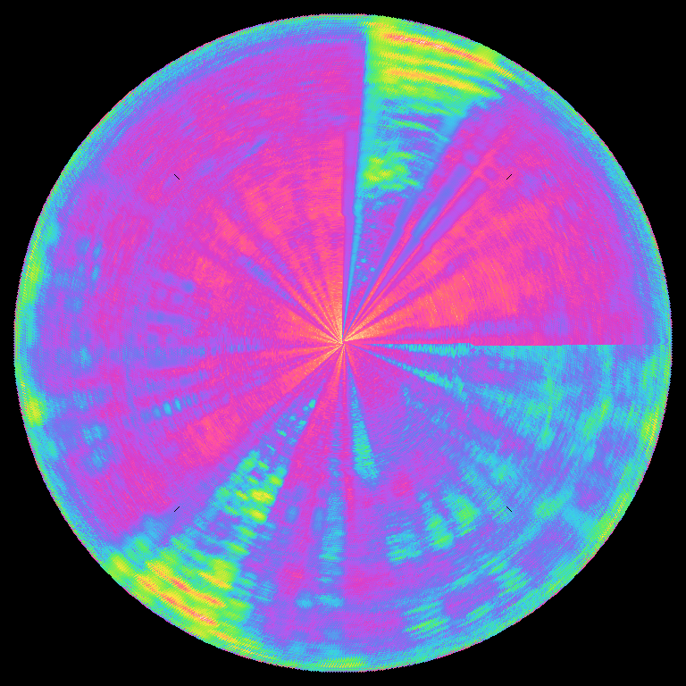

<h1>Voice Tableau</h1>

_**Voice Tableau**_ is a real-time sound spectrogram visualizer, leveraging _PortAudio_ to capture input audio from the device microhphone, _FFTW3_ to perform Fast Fourier Transform on the data stream and _OpenCV_ to visualize the results. Instead of the traditional rectangular visualization, _**Voice Tableau**_
creates an circular rolling representation of the input audio; kind of like a radar!

---

<h3>Origins</h3>

_**Voice Tableau**_ is a product of the mind of Mohammad Hekmat - my uncle - who was inspired by the works of Mexican-Canadian artist Rafael Lozano-Hemmer.

---

<h3>How to generate a <b><i>Voice Tableau</i></b></h3>

To build the project, make sure to have the following dependencies installed:

<ul>
  <li>PortAudio</li>
  <li>FFTW3</li>
  <li>OpenCV</li>
</ul>

The available Makefile is for Mac users (tested and verified on <b>OSX Ventura</b>).
 
The project can be built with:
~~~
make
~~~
and run with:
~~~
./voice_tableau
~~~

---

<h3>Saving a tableau</h3>

Pressing the spacebar at any point during the running visualization will take a snapshot of the tableau and save it to your device.

---

<h3>Sample tableau</h3>

The following tableau visualizes the beginning of _Andante Risoluto_ from the fourth season of the _HBO_ series _Succession_.

---

<i>Developed by Farzan Mirshekari & Mohammad Hekmat</i>
